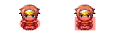
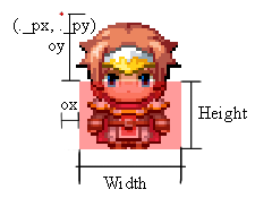

# QMovement
## Plugin Parameters
TODO

## Colliders
There are 3 types of colliders; Polygon, Box and Circle. Though you can only create
box and circle colliders, unless you modify the code to accept polygons. This is
intentional since polygon would be "harder" to setup.

**Boxes** takes in width, height, offset x and offset y

**Circles** similar to boxes, takes in width, height, offset x and offset y

### Setting up colliders
Colliders are setup inside the Players notebox or as a comment inside an Events page. Events colliders depends it's page, so you may need to make the collider on all pages.

There are two ways to setup colliders. using `<collider:-,-,-,->` and using
`<colliders>-</colliders>`. The first method sets the 'Default' collider for that
character. The second one you create the colliders for every collider type.

### Collider Types
There are 3 collider types. Default, Collision and Interaction.
- Default: This is the collider to use if collider type that was called was not found
- Collision: This collider is used for collision checking
- Interaction: This collider is used for checking interaction.

## Collider Terms

### Collider Notetag
~~~
<collider: shape, width, height, ox, oy>
~~~
This notetag sets all collider types to these values.
- Shape: Set to box or circle
- Width: The width of the collider
- Height: The height of the collider
- OX: The x offset value of the collider
- OY: The y offset value of the collider

### Colliders Notetag
~~~
<colliders>
type: shape, width, height, ox, oy
</colliders>
~~~
This notetag sets all collider types to these values.
- Type: The type of collider, set to default, collision or interaction
- Shape: Set to box or circle
- Width: The width of the collider
- Height: The height of the collider
- OX: The x offset value of the collider
- OY: The y offset value of the collider

To add another type, just add `type: shape, width, height, ox, oy` on another line.

Example:
~~~
<colliders>
default: box, 48, 48
collision: circle, 24, 24, 12, 12
interaction: box: 32, 32, 8, 8
</colliders>
~~~

## Move Routes
TODO

## Addons
None yet
